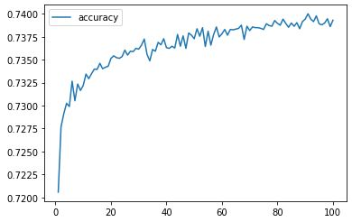
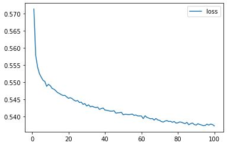

# deep-learning-challenge
Charity Funding Predictor - University of Birmingham Assignment 

## Report

The nonprofit foundation Alphabet Soup wants a tool that can help it select the applicants for funding with the best chance of success in their ventures. Using machine learning and neural networks, I have created a binary classifier that can predict with a 73% of accuracy whether applicants will be successful if funded by Alphabet Soup:

* I have created 7 different models, all with similar results. I have not achieved the goal of 75% accuracy, as all the models have resulted in an accuracy of 73%, with a loss always close to 0.6. 

From Alphabet Soup’s business team, I have received a CSV containing more than 34,000 organizations that have received funding from Alphabet Soup over the years. Within this dataset are a number of columns that capture metadata about each organization, such as:

* **EIN** and **NAME**—Identification columns
* **APPLICATION_TYPE**—Alphabet Soup application type
* **AFFILIATION**—Affiliated sector of industry
* **CLASSIFICATION**—Government organization classification
* **USE_CASE**—Use case for funding
* **ORGANIZATION**—Organization type
* **STATUS**—Active status
* **INCOME_AMT**—Income classification
* **SPECIAL_CONSIDERATIONS**—Special consideration for application
* **ASK_AMT**—Funding amount requested
* **IS_SUCCESSFUL**—Was the money used effectively

As a first step, I have eliminated the ID columns because they do not add value and may bias the sample. In addition, I have converted the categorical variables to numerical variables.

I have then trained different models to try to predict the output "IS_SUCCESSFUL", in which I have alternately added neurons, layers and epochs, and I have also tried different activation functions, but in all cases the results have been very similar: an accuracy of 73%, with a loss always close to 0.6.

For this reason, I recommend using a simple model, with two layers of 80 and 30 neurons respectively using the ReLu activation function, and a binary output using Sigmoid, in 100 epochs. This will provide an acceptable accuracy at a low computational cost.

- - -

## Instructions

### Step 1: Preprocess the Data

Using Pandas and scikit-learn’s `StandardScaler()`:

1. Read in the charity_data.csv to a Pandas DataFrame, and be sure to identify the following in your dataset:
  * What variable(s) are the target(s) for your model?
  * What variable(s) are the feature(s) for your model?

2. Drop the `EIN` and `NAME` columns.

3. Determine the number of unique values for each column.

4. For columns that have more than 10 unique values, determine the number of data points for each unique value.

5. Use the number of data points for each unique value to pick a cutoff point to bin "rare" categorical variables together in a new value, `Other`, and then check if the binning was successful.

6. Use `pd.get_dummies()` to encode categorical variables.

### Step 2: Compile, Train, and Evaluate the Model

Using TensorFlow, design a neural network, or deep learning model, to create a binary classification model that can predict if an Alphabet Soup–funded organization will be successful based on the features in the dataset. Think about how many inputs there are before determining the number of neurons and layers in your model. Once you’ve completed that step, you’ll compile, train, and evaluate your binary classification model to calculate the model’s loss and accuracy.

1. Continue using the Jupyter Notebook in which you performed the preprocessing steps from Step 1.

2. Create a neural network model by assigning the number of input features and nodes for each layer using TensorFlow and Keras.

3. Create the first hidden layer and choose an appropriate activation function.

4. If necessary, add a second hidden layer with an appropriate activation function.

5. Create an output layer with an appropriate activation function.

6. Check the structure of the model.

7. Compile and train the model.

8. Create a callback that saves the model's weights every five epochs.

9. Evaluate the model using the test data to determine the loss and accuracy.

10. Save and export your results to an HDF5 file. Name the file `AlphabetSoupCharity.h5`.

### Step 3: Optimize the Model

Using your knowledge of TensorFlow, optimize your model to achieve a target predictive accuracy higher than 75%.

Using any or all of the following methods to optimize your model:

* Adjust the input data to ensure that no variables or outliers are causing confusion in the model, such as:
  * Dropping more or fewer columns.
  * Creating more bins for rare occurrences in columns.
  * Increasing or decreasing the number of values for each bin.
* Add more neurons to a hidden layer.
* Add more hidden layers.
* Use different activation functions for the hidden layers.
* Add or reduce the number of epochs to the training regimen.

### Step 4: Write a Report on the Neural Network Model

For this part of the assignment, you’ll write a report on the performance of the deep learning model you created for AlphabetSoup.

- - -

© 2022 University of Birmingham / Data Analysis Assignment by DianaAF	